# - Governança de Dados e Ciclo de Vida de Machine Learning

## - Ciclo de Vida dos Dados

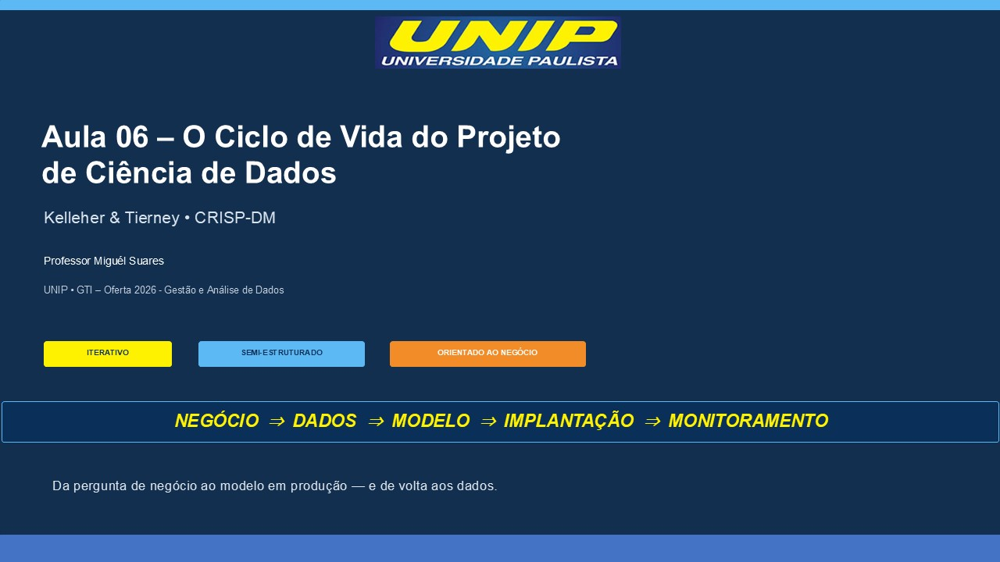

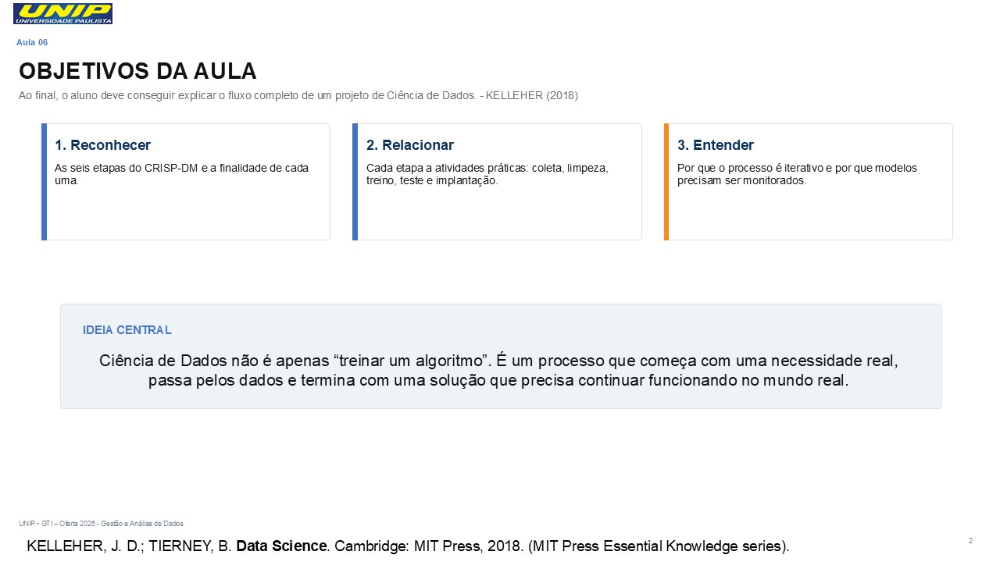

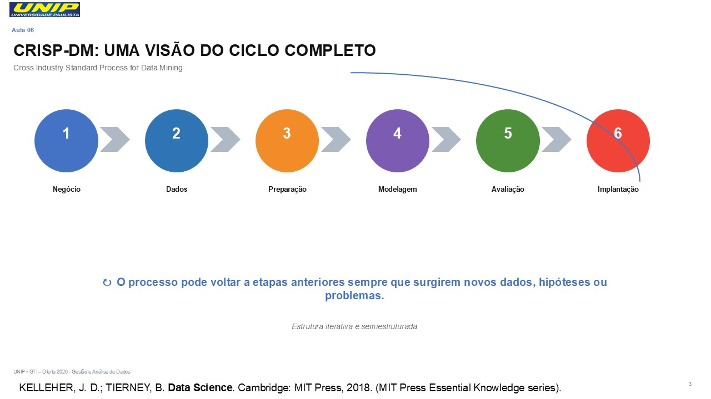

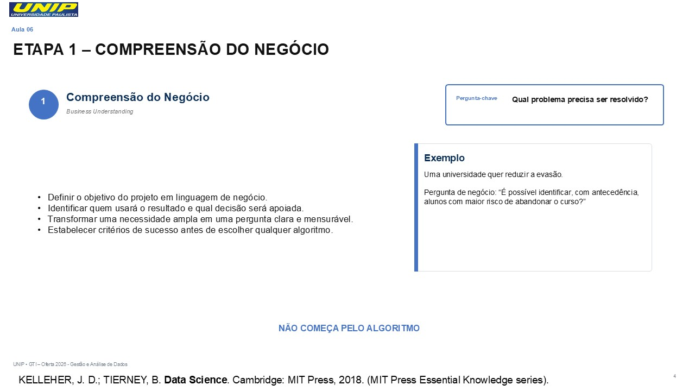

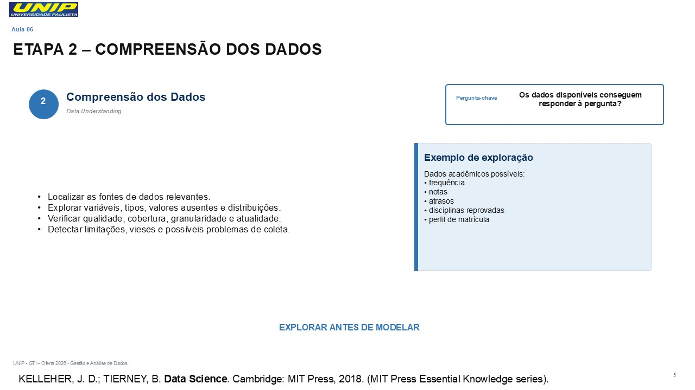

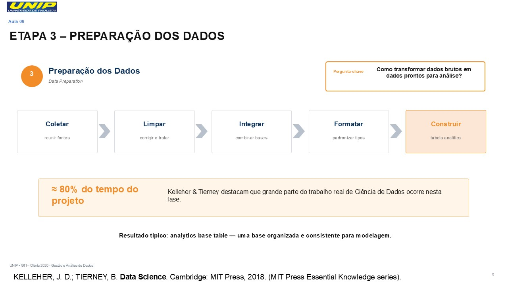

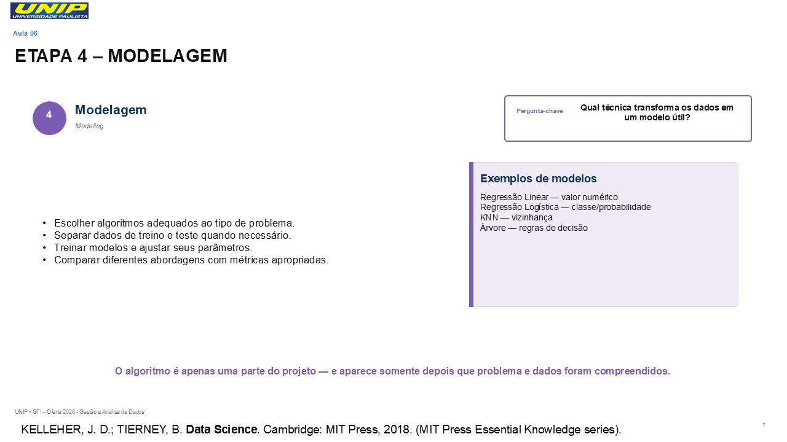

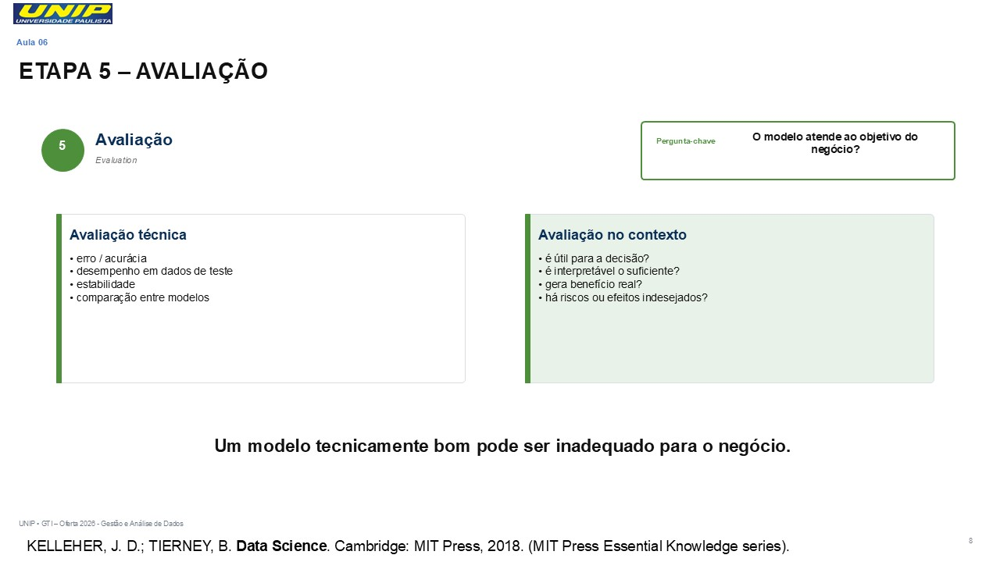

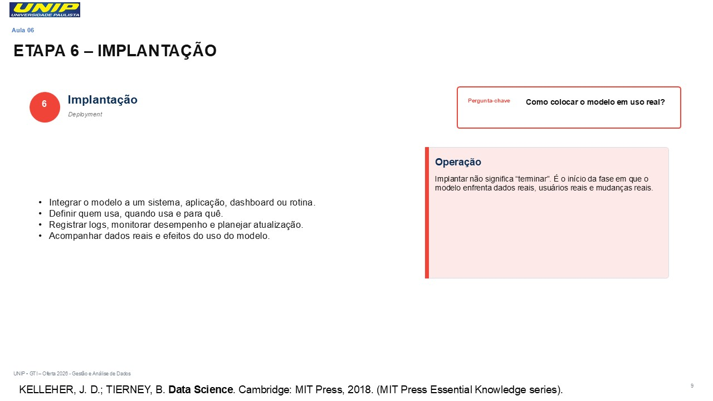

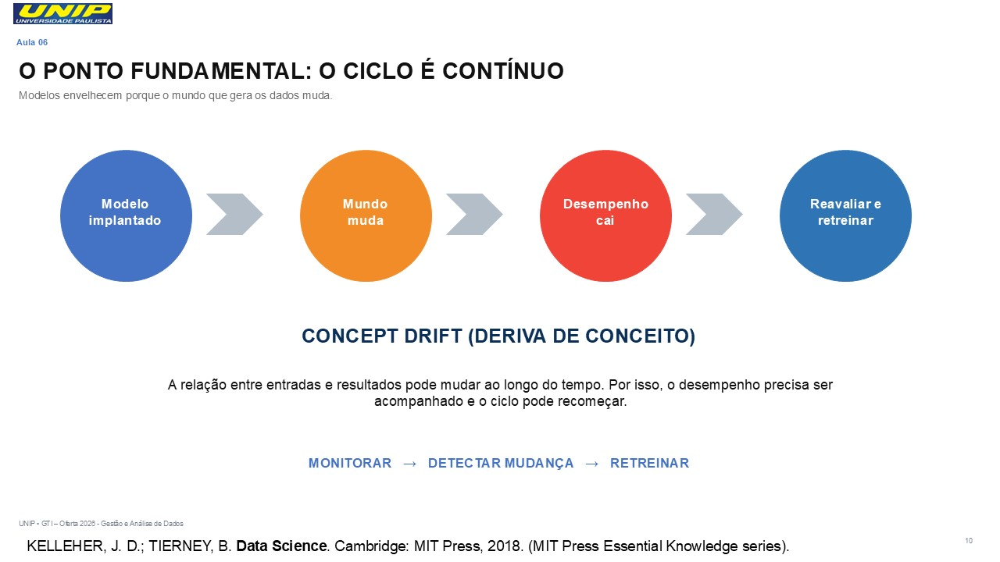

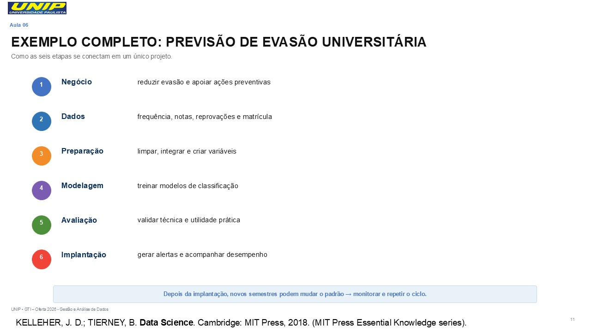

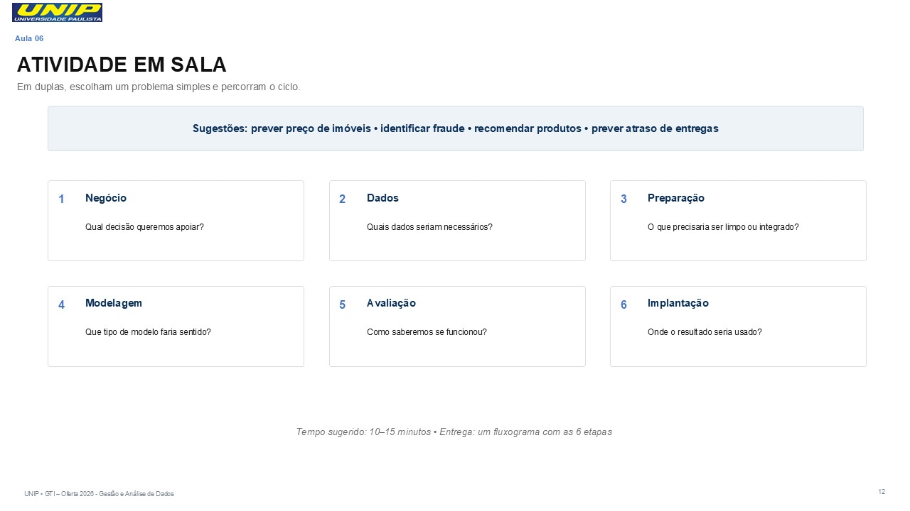

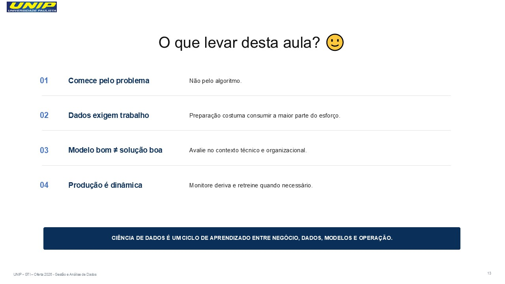

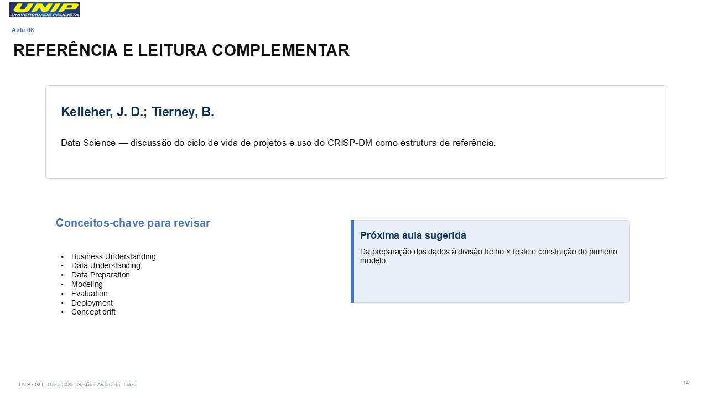


```{r 02-2026-08-18-governanca_de_dados_e_ciclo_de_vida_de_machine_learning, eval=FALSE, include=FALSE}
rmarkdown::render("02-2026-08-18-governanca_de_dados_e_ciclo_de_vida_de_machine_learning.rmd", output_dir="docs", output_file ="temporario.html" , output_format = "html_document") ; utils::browseURL("docs/temporario.html")
```

```{r 02-2026-08-18-governanca_de_dados_e_ciclo_de_vida_de_machine_learning-doc, eval=FALSE, include=FALSE}
rmarkdown::render("02-2026-08-18-governanca_de_dados_e_ciclo_de_vida_de_machine_learning.rmd", output_dir="docs", output_file ="temporario.docx" , output_format = "word_document") ; utils::browseURL("docs/temporario.docx")
```
