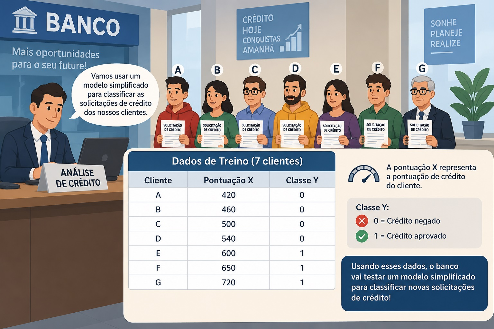

## - Exercícios - Análise de Dados: Dilema Viés-Variância e Métricas de Avaliação

### Exercícios de TREINO e TESTE de Modelos

#### Exercício 1 — Regressão Linear: tempo de entrega

::: {.alert .alert-info}
Uma empresa de entregas quer estimar o **tempo de entrega** de um pedido a partir da **distância até o cliente**. Considere:
:::


$$
\boxed{\text{Entrada } X = \text{distância da entrega, em km}}
$$

$$
\boxed{\text{Saída } Y = \text{tempo de entrega, em minutos}}
$$

::: {.alert .alert-info}
A empresa coletou dados de 10 entregas. Sete serão usados para treinar o modelo e três para testar.
:::

::: {.alert .alert-warning}
> Dados de treino

Lembrando que no treino seu modelo é criado através da descoberta dos (melhores) valores dos PARÂMETROS `w` e `b`.

Segue o dataset de dados de treino do seu modelo.
:::

| Entrega | Distância $X$ km | Tempo $Y$ min |
|:-------:|:----------------:|:-------------:|
|    A    |        2         |      18       |
|    B    |        3         |      21       |
|    C    |        4         |      25       |
|    D    |        5         |      28       |
|    E    |        6         |      32       |
|    F    |        8         |      38       |
|    G    |        10        |      45       |

::: {.alert .alert-warning}
Use um modelo linear para resolver o problema. Seu modelo deve ter a "cara" de uma equação de reta:
:::

$$
\hat y = wx+b
$$

::: {.alert .alert-warning}
Resolva utilizando programação. No python utilize o pacote `LinearRegression` da biblioteca `SciKitLearn`:
:::

``` python
from sklearn.linear_model import LinearRegression
```

::: {.alert .alert-success}
> Dados de teste

Uma vez criado o seu modelo $\hat y = wx+b$, use os dados de teste a seguir
:::

| Entrega | Distância $X$ km | Tempo real $Y$ min |
|:-------:|:----------------:|:------------------:|
|    H    |       3.5        |         23         |
|    I    |        7         |         35         |
|    J    |        9         |         42         |

::: {.alert .alert-info}
Descubra:

-   Qual é a saída prevista pelo seu modelo para a entrega `H`, `I` e `J` ?
-   Qual é a saída real para a entrega `H`, `I` e `J` ?
-   Qual é a diferença entre a saída real e a saída prevista pelo seu modelo para `H`, `I` e `J`, também chamado de M.S.E. ?
:::

##### Tarefas

``` python
import numpy as np
from sklearn.linear_model import LinearRegression
from sklearn.metrics import mean_squared_error

X_train = np.array([
    [2],
    [3],
    [4],
    [5],
    [6],
    [8],
    [10]
])

y_train = np.array([
    18,
    21,
    25,
    28,
    32,
    38,
    45
])

X_test = np.array([
    [3.5],
    [7],
    [9]
])

y_test = np.array([
    23,
    35,
    42
])

modelo = LinearRegression()

modelo.fit(X_train, y_train)

w = modelo.coef_[0]
b = modelo.intercept_

print("w =", w)
print("b =", b)

y_pred = modelo.predict(X_test)

print("Previsões:", y_pred)

mse = mean_squared_error(y_test, y_pred)

print("MSE teste =", mse)

nova_distancia = np.array([[7.5]])

tempo_estimado = modelo.predict(nova_distancia)

print("Tempo estimado:", tempo_estimado[0])
```

A ideia conceitual do exercício é:

$$
\boxed{
\text{distância}
\rightarrow
\text{modelo linear}
\rightarrow
\text{tempo estimado}
}
$$

#### Exercício 2 — Regressão Logística: aprovação de crédito

::: {.alert .alert-info}
Agora queremos trabalhar com **classificação**, não com previsão de um valor contínuo. Um banco está testando um modelo simplificado para classificar solicitações de crédito.

Considere:
:::



$$
\boxed{\text{Entrada } X = \text{pontuação de crédito}}
$$

e:

$$
\boxed{\text{Saída } Y =
\begin{cases}
0, & \text{crédito não aprovado}\\
1, & \text{crédito aprovado}
\end{cases}}
$$

::: {.alert .alert-info}
Temos novamente 10 clientes: 7 para treinamento e 3 para teste.
:::

::: {.alert .alert-warning}
> Dados de treino
:::

| Cliente | Pontuação $X$ | Classe $Y$ |
|:-------:|:-------------:|:----------:|
|    A    |      420      |     0      |
|    B    |      460      |     0      |
|    C    |      500      |     0      |
|    D    |      540      |     0      |
|    E    |      600      |     1      |
|    F    |      650      |     1      |
|    G    |      720      |     1      |

::: {.alert .alert-warning}
Os alunos devem treinar um modelo de Regressão Logística:
:::

$$
\text{% de Probabilidade de saída "Y" ser TRUE, tal que entrada vale X será igual a } \mathbf{\frac{1}{1+e^{-(wx+b)}} } \\
\boxed{P(Y=TRUE|X) = \frac{1}{1+e^{-(wx+b)}}}
$$

::: {.alert .alert-sucess}
> Dados de teste
:::

| Cliente | Pontuação $X$ | Classe real $Y$ |
|:-------:|:-------------:|:---------------:|
|    H    |      480      |        0        |
|    I    |      580      |        1        |
|    J    |      680      |        1        |

##### Tarefas

::: {.alert .alert-info}
-   Crie `X_train`, `y_train`, `X_test` e `y_test`.
-   Treine uma `LogisticRegression`.
-   Use o python para descubra os parâmetros :
:::

$$
\text{Parâmetro } \boxed{w}
$$

e

$$
\text{Parâmetro } \boxed{b}
$$

-   Calcule as probabilidades:

$$
\text{Probabilidade da saída Y ser classificada como TRUE} \\
\\
\boxed{P(Y=TRUE)}
$$

para os três dados de teste.

-Classifique os três clientes usando o limiar (threshold) de 50%:

$$
\text{saída Y igual ou acima de 50%, classifica como TRUE, "pode emprestar dinheiro"} \\
\text{saída Y abaixo de 50%, classifica como FALSE, "não emprestar dinheiro"} \\
\boxed{\text{threshold}=0{,}5} \\
P(Y=TRUE|X) = \frac{1}{1+e^{-(wx+b)}} \\
\text{em outras palavras } \\
\text{considere como TRUE: empresta grana se }\frac{1}{1+e^{-(wx+b)}} \textbf{>= 50%}
\\
\text{considere como FALSE: não empresta grana se }\frac{1}{1+e^{-(wx+b)}} \textbf{< 50% }
$$

::: {.alert .alert-info}
-   Compare as classes previstas com as classes reais.
-   Calcule a acurácia no conjunto de teste.
-   Use o modelo para responder:

> **Um cliente com pontuação de crédito igual a 560 seria classificado como crédito aprovado ou não aprovado?**

-   Informe também a probabilidade estimada de aprovação.
:::

##### Estrutura esperada em Python

``` python
import numpy as np
from sklearn.linear_model import LogisticRegression
from sklearn.metrics import accuracy_score

X_train = np.array([
    [420],
    [460],
    [500],
    [540],
    [600],
    [650],
    [720]
])

y_train = np.array([
    0,
    0,
    0,
    0,
    1,
    1,
    1
])

X_test = np.array([
    [480],
    [580],
    [680]
])

y_test = np.array([
    0,
    1,
    1
])

modelo = LogisticRegression()

modelo.fit(X_train, y_train)

w = modelo.coef_[0][0]
b = modelo.intercept_[0]

print("w =", w)
print("b =", b)

probabilidades = modelo.predict_proba(X_test)[:, 1]

print("Probabilidades:", probabilidades)

y_pred = modelo.predict(X_test)

print("Classes previstas:", y_pred)

acc = accuracy_score(y_test, y_pred)

print("Acurácia teste =", acc)

novo_cliente = np.array([[560]])

prob = modelo.predict_proba(novo_cliente)[0][1]
classe = modelo.predict(novo_cliente)[0]

print("Probabilidade de aprovação =", prob)
print("Classe prevista =", classe)
```

```{r 05-2026-09-08-analise_de_dados_dilema_vies-variancia_e_metricas_de_avaliacao-exercicios, eval=FALSE, include=FALSE}
rmarkdown::render("05-2026-09-08-analise_de_dados_dilema_vies-variancia_e_metricas_de_avaliacao-exercicios.rmd", output_dir="docs", output_file ="temporario.html" , output_format = "html_document") ; utils::browseURL("docs/temporario.html")
```

```{r 05-2026-09-08-analise_de_dados_dilema_vies-variancia_e_metricas_de_avaliacao-exercicios-doc, eval=FALSE, include=FALSE}
rmarkdown::render("05-2026-09-08-analise_de_dados_dilema_vies-variancia_e_metricas_de_avaliacao-exercicios.rmd", output_dir="docs", output_file ="temporario.docx" , output_format = "word_document") ; utils::browseURL("docs/temporario.docx")
```
