# - Análise de Dados: Dilema Viés-Variância e Métricas de Avaliação

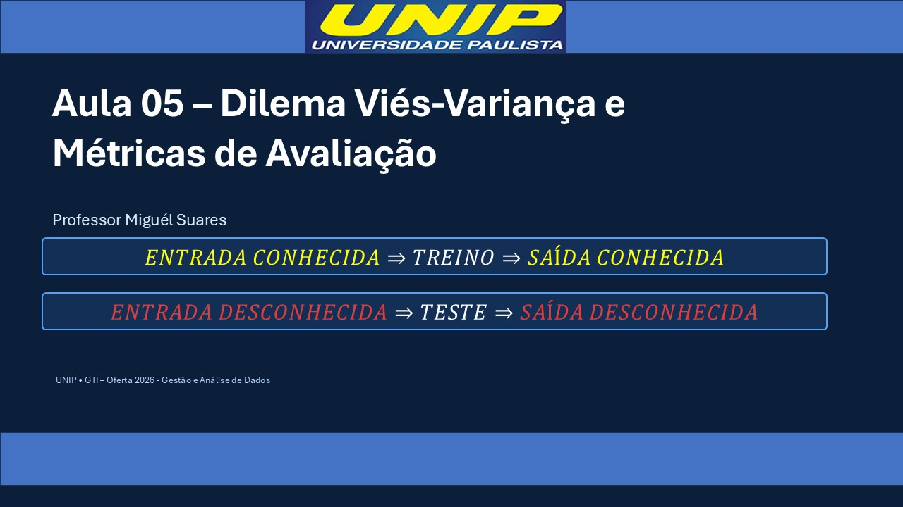

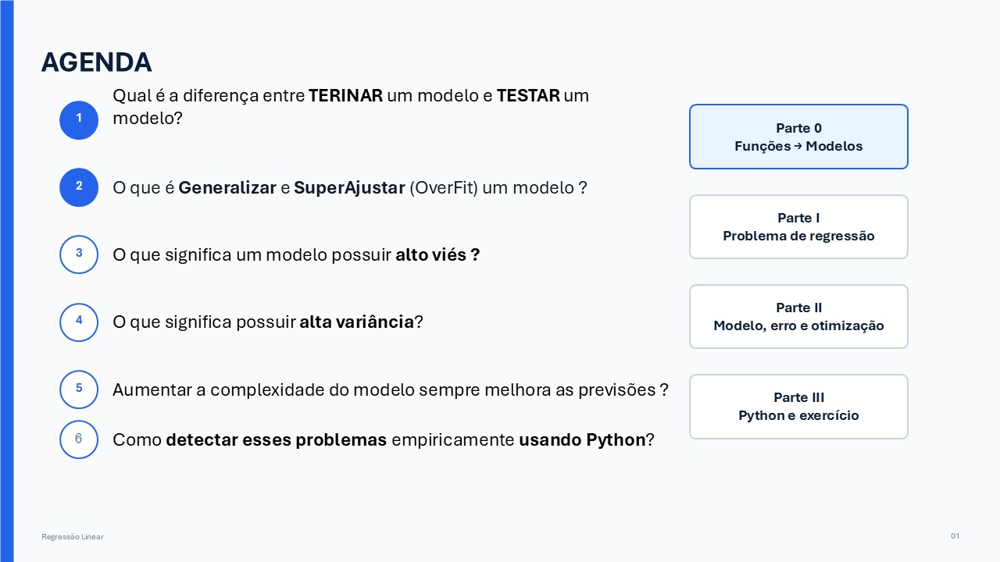


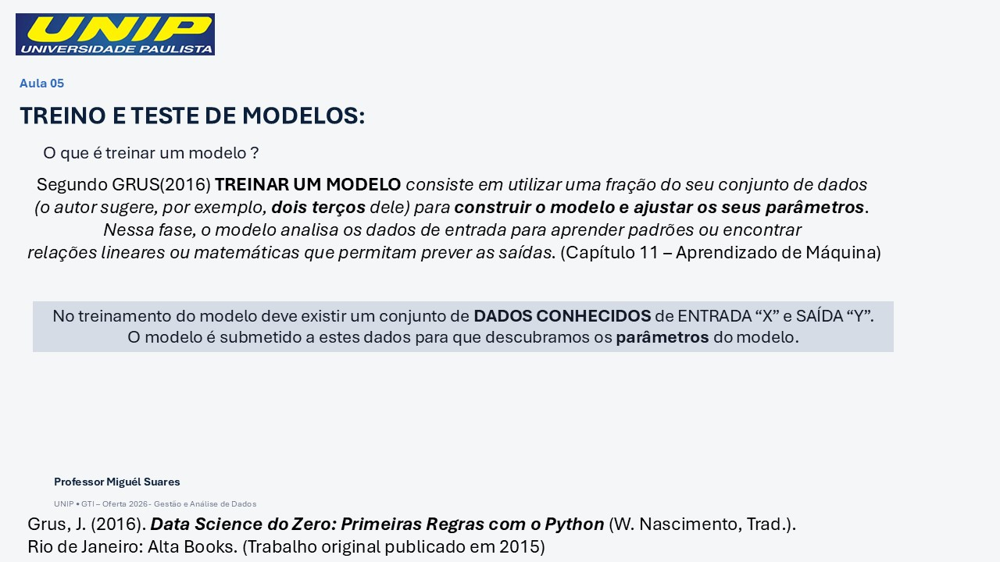

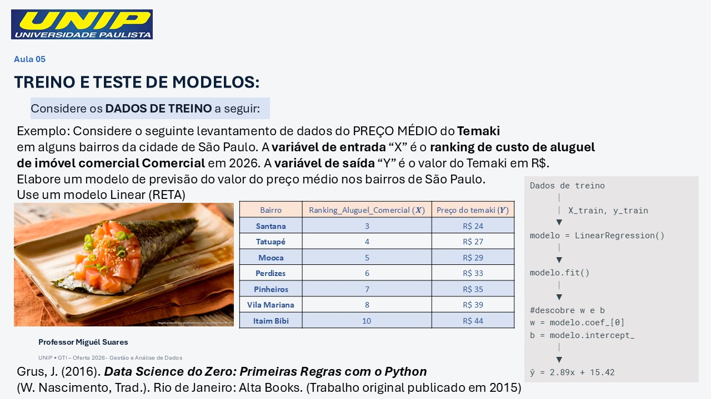

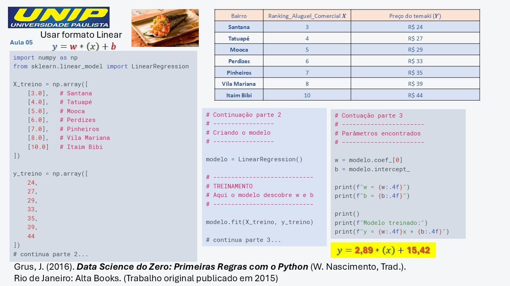

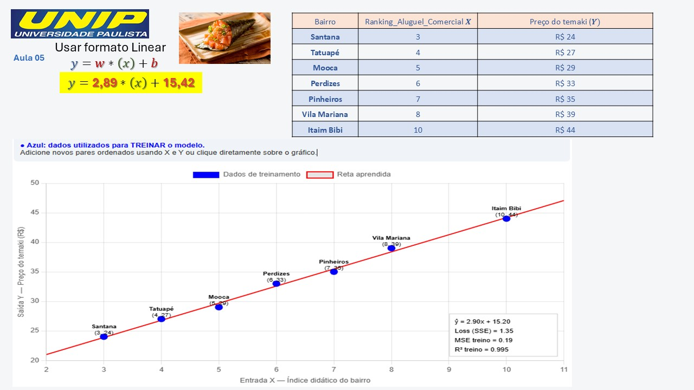

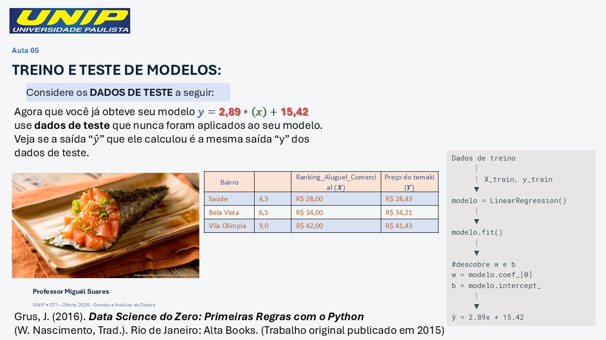

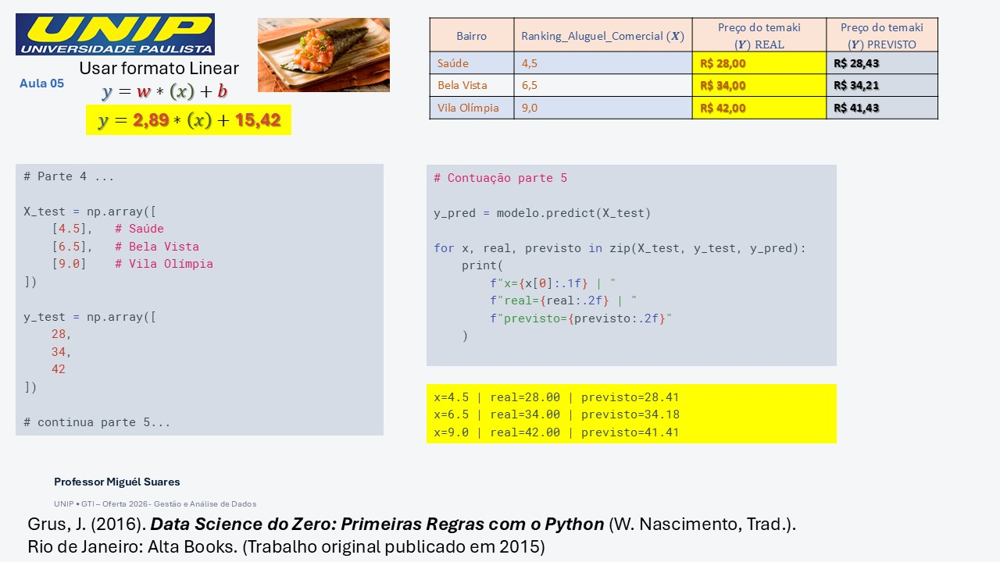

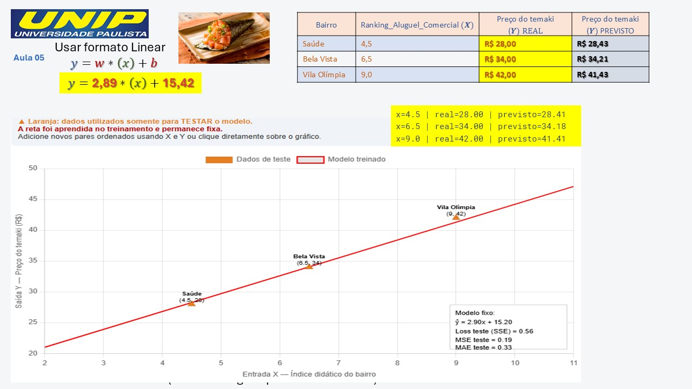

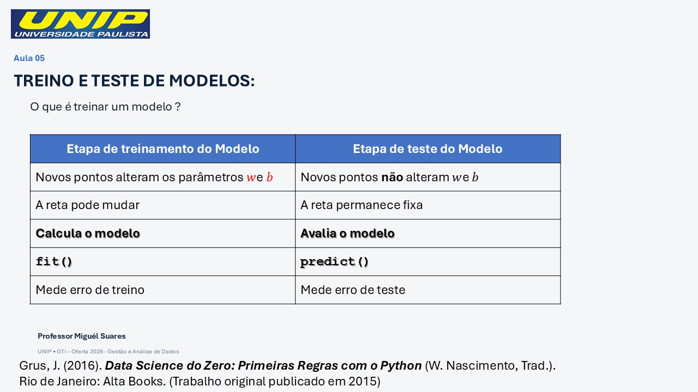


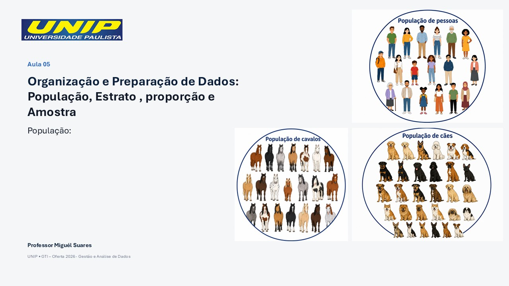


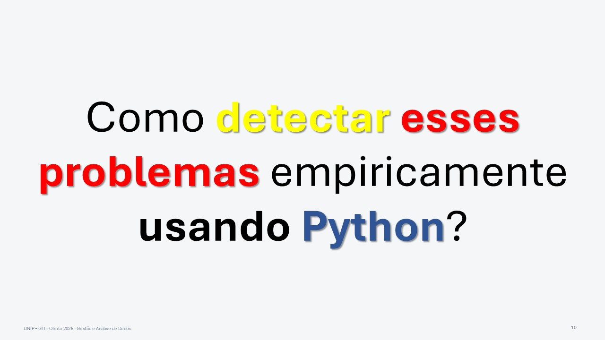


```{r 05-2026-09-08-analise_de_dados_dilema_vies-variancia_e_metricas_de_avaliacao, eval=FALSE, include=FALSE}
rmarkdown::render("05-2026-09-08-analise_de_dados_dilema_vies-variancia_e_metricas_de_avaliacao.rmd", output_dir="docs", output_file ="temporario.html" , output_format = "html_document") ; utils::browseURL("docs/temporario.html")
```

```{r 05-2026-09-08-analise_de_dados_dilema_vies-variancia_e_metricas_de_avaliacao-doc, eval=FALSE, include=FALSE}
rmarkdown::render("05-2026-09-08-analise_de_dados_dilema_vies-variancia_e_metricas_de_avaliacao.rmd", output_dir="docs", output_file ="temporario.docx" , output_format = "word_document") ; utils::browseURL("docs/temporario.docx")
```
