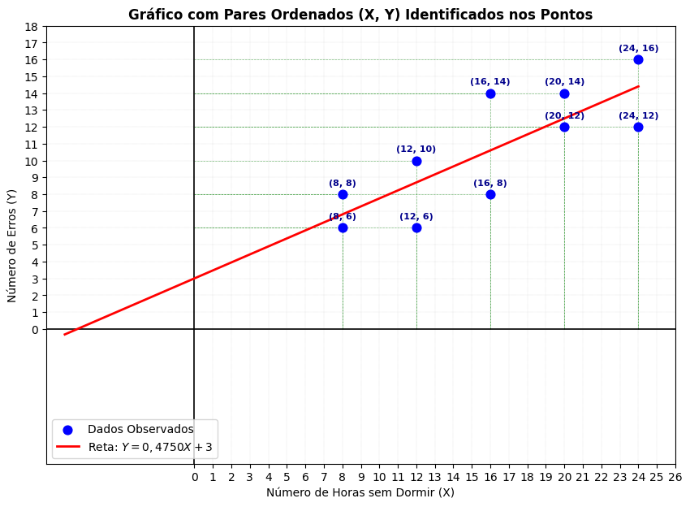

# Plotando o gráfico do exemplo 01

Importando as bibliotecas


```python
import numpy as np
import matplotlib.pyplot as plt

# Dados do problema
x = np.array([8, 8, 12, 12, 16, 16, 20, 20, 24, 24])
y = np.array([6, 8, 6, 10, 8, 14, 12, 14, 12, 16])

# Configuração do gráfico
plt.figure(figsize=(10, 7))

# Definindo os limites dos eixos começando em 0
plt.xlim(-8, max(x) + 2)
plt.ylim(-8, max(y) + 2)

# Configurando a escala unitária (passo de 1 em 1) para os eixos X e Y
plt.xticks(np.arange(0, max(x) + 3, 1))
plt.yticks(np.arange(0, max(y) + 3, 1))

# Grade padrão em cinza claro para a escala geral
for xtick in np.arange(0, max(x) + 3, 1):
    plt.axvline(xtick, color='gray', linewidth=0.3, linestyle=':', alpha=0.5, zorder=1)

for ytick in np.arange(0, max(y) + 3, 1):
    plt.axhline(ytick, color='gray', linewidth=0.3, linestyle=':', alpha=0.5, zorder=1)

# Projetando linhas vermelhas contínuas sobre os pares ordenados formados pelos vetores x e y
for xi, yi in zip(x, y):
    plt.vlines(xi, 0, yi, color='green', linewidth=0.5, linestyle='--', alpha=0.5, zorder=2)
    plt.hlines(yi, 0, xi, color='green', linewidth=0.5, linestyle='--', alpha=0.5, zorder=2)

# Destacando os eixos principais em (0,0)
plt.axhline(0, color='black', linewidth=1.2, zorder=3)
plt.axvline(0, color='black', linewidth=1.2, zorder=3)

# Gráfico de dispersão (pontos observados)
plt.scatter(x, y, color='blue', label='Dados Observados', s=60, zorder=5)

# Adicionando rótulos com os pares ordenados (X, Y) em cada ponto
for xi, yi in zip(x, y):
    plt.annotate(f"({xi}, {yi})",
                 (xi, yi),
                 textcoords="offset points",
                 xytext=(0, 8),  # Deslocamento vertical do texto em relação ao ponto
                 ha='center',
                 fontsize=8,
                 fontweight='bold',
                 color='darkblue',
                 zorder=6)

# Definindo os pontos para a reta y = 0.4750 * x + 3
x_linha = np.linspace(-7, max(x), 100)
y_linha = 0.4750 * x_linha + 3

# Plotando a reta de regressão
plt.plot(x_linha, y_linha, color='red', linestyle='-', linewidth=2, label='Reta: $Y = 0,4750X + 3$', zorder=4)

# Rótulos e formatação
plt.title('Gráfico com Pares Ordenados (X, Y) Identificados nos Pontos', fontsize=12, fontweight='bold')
plt.xlabel('Número de Horas sem Dormir (X)', fontsize=10)
plt.ylabel('Número de Erros (Y)', fontsize=10)
plt.legend()

# Exibir o gráfico
plt.show()
```


    

    

